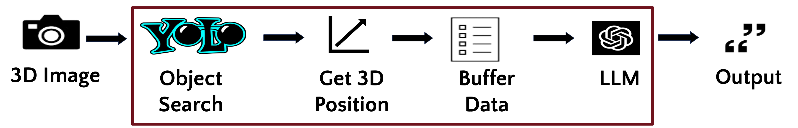

### Project Demo  

  <video width="100%" height="auto" controls>
    <source src="nlp_project_video.mp4" type="video/mp4">
    Your browser does not support the video tag.
  </video>

---
### Motivation  
This project explores the potential of large language models (LLMs) to assist visually impaired individuals by reasoning about their surroundings based on detected objects and their spatial positions. By leveraging AI, we aim to enhance both navigation and environmental awareness.

---

### Problem Definition  
How can we use a stream of RGB-D video data to inform a visually impaired person about their environment through coherent and actionable language generated by an LLM?

---

### Proposed Approach  
We employ object detection to identify and localize objects within the scene. Depth information is combined with these detections and processed to derive spatial positions. This data is then passed to an LLM, enabling contextual reasoning and temporal awareness to generate user-friendly descriptions.

Key benefits of this approach include:  
- **Efficiency:** Lightweight object detection is used instead of computationally heavy vision-language models (VLMs).  
- **Scalability:** Temporal data integration ensures coherent scene descriptions.  

The image below shows an example of the pipeline and framework, with the navigation module pipeline within the maroon box.

  

---

### System Modules  

#### 1. **Navigation**  
- **Workflow:**  
  - Images are captured via an Intel RealSense L515 LiDAR camera.  
  - Objects are detected using YOLOv11, and their 3D spatial positions are computed.  
  - This spatial data is processed into textual descriptions via a custom proximity map.  
  - An LLM queries the last 15 seconds of data to generate clear and concise updates.  

#### 2. **Visual Question Answering**  
- Allows users to query static scenes interactively using the BLIP package to gain more in-depth information.

#### 3. **Scene Description**  
- Uses the BLIP model to provide general captions for scenes, offering quick overviews for static environments.  

---

### Experimental Results  
To evaluate the system, we conducted user preference surveys comparing responses generated by:  
- A standalone Vision-Language Model (VLM).  
- The proposed navigation module integrated with an LLM.

Participants reviewed side-by-side video outputs and rated the usefulness of each system on a scale of 1–5. 

---

### Main Findings  
- **Strengths:**  
  - The LLM demonstrated exceptional coherence in reasoning based on object labels and spatial data.  
  - Textual descriptions significantly enhanced the model's usability for navigation tasks.  

- **Challenges:**  
  - Limited replicability due to proprietary models and hardware dependencies.  
  - Small evaluation sample (22 data points) restricts broader conclusions.  

---

### Potential Impact  
This work represents a promising step forward in assistive technology by combining AI and robotics to provide greater independence and safety for visually impaired individuals. It has potential applications for assistive tech companies and researchers seeking to develop advanced human-centric systems.

---

### Limitations and Future Work  
- **Hardware Constraints:** The Intel RealSense L515 is limited to indoor environments and objects within 9 meters.  
- **Object Detection:** The YOLO model is restricted to 80 predefined classes, leading to occasional inaccuracies.  
- **Inference Timing:** Fixed time windows limit responsiveness; context-aware inferences could address this.  

Future improvements may include integrating IMU data, dynamic time windows, and open-source alternatives to enhance replicability and scalability.

---

### Collaboration  
This project was developed in collaboration with Mohit Yadav, Abbas Booshehrain, and Ruolei Zeng, fellow students at the University of Minnesota.
